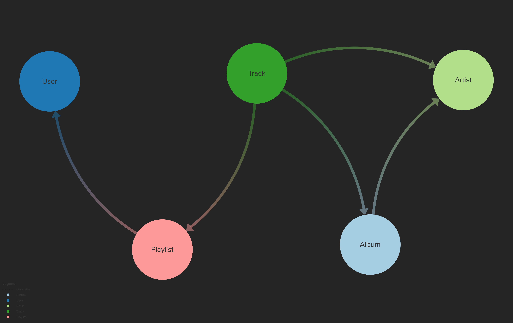

PyRate is a music data collator that aims to create "shuffling channels" to help you navigate your music listening journey. 

#### Milestones Reached
- Fully functional lyric pronunciation prediction model via LSTM trained on CMU Pronunciation Dictionary
- Fully functional Spotify and Genius API classes
- Scraped Billboard to get historical chart data from week 1 in 1968
- Profiling of a user's Spotify data to get all the user's playlists, all the tracks in each playlist, and all the tracks in each album of each track in the playlist.
- Above data has been fully imported into AWS Neo4J Instance

#### To Do
- Implement view
- Implement "smart shuffle"
- Search Genius for each Billboard song and get Spotify URIs for each Billboard node, then add join that with the track node
- Get user's Last.fm data
- Implement serverless configuration via AWS Lambda
- Analyze lyrical and rhyme scheme diversity
- Analyze chord progressions for auto-DJ

## Schema
Below, you can see how the Neo4J data is organized:

## Directory breakdown
- <code>input/</code>

Contains lyrics subdirectory and CMU pronunciation dictionary files necessary to run the LSTM for pronunciation predictions.

-  <code>model/</code>

All the LSTM files from Kaggle. I collated the Jupyter notebook from [this Kaggle article](https://www.kaggle.com/reppic/predicting-english-pronunciations) into a class that can predict pronunciations.

<code>rap_analyzer.py</code> aims to use the attention model to analyze lyrics, but right now it can just read a lyrics file from the input directory and predict all the pronunciations.

- <code>notebooks/</code>

Some sample notebooks dealing with the pronunciation project. I don't think there's anything relevant in there anymore.

- <code>samples/</code>

Some simple programs originally in <code>root.py</code>, but moved them here so it's cleaner and easier to read.

- <code>scraper/</code>

All the code that scrapes Spotify, Genius, and Billboard. Puts output in the <code>output/</code> directory.

## Running the code

<code>root.py</code> initiates the program, importing a sample from the <code>samples/</code> subdirectory and running its <code>main()</code> function. 